<div align="center">
  
  <h1>Code Beyond Math</h1>
  <p><em>Explorează matematica și informatica dincolo de manual.</em></p>
  <p>
    <a href="https://codebeyondmath.github.io/Code-Beyond-Math/">🌐 Website live</a> &nbsp;·&nbsp;
    <a href="#viii-demo-uri-și-capturi-de-ecran">📸 Demo</a> &nbsp;·&nbsp;
    <a href="#ix-echipă-și-contact">📬 Contact</a>
  </p>
</div>

---

## Cuprins

1. [Despre proiect](#i-despre-proiect)
2. [Arhitectura platformei](#ii-arhitectura-platformei)
3. [Funcționalități](#iii-funcționalități)
4. [Structura temelor](#iv-structura-temelor)
5. [Structura problemelor](#v-structura-problemelor)
6. [Securitate și API](#vi-securitate-și-api)
7. [Deployment](#vii-deployment)
8. [Demo-uri și Capturi de Ecran](#viii-demo-uri-și-capturi-de-ecran)
9. [Echipă și Contact](#ix-echipă-și-contact)

---

## I. Despre proiect

**Code Beyond Math** este o platformă web educațională interactivă care îi ajută pe elevi să descopere matematica și informatica _dincolo de manual_ — într-un mod vizual, intuitiv și accesibil.

Proiectul pornește de la o problemă reală: multe dintre cele mai frumoase și utile idei din matematică și informatică nu apar deloc în programa școlară, sau apar prea abstract pentru a fi cu adevărat înțelese. Code Beyond Math umple acest gol, transformând concepte avansate — criptografie, teoria grafurilor, transformate rapide, fractali, automate celulare — în experiențe interactive pe care oricine le poate explora direct în browser.

**Publicul țintă** sunt elevii de liceu cu interes pentru matematică și informatică, dar și profesorii care caută resurse vizuale pentru predarea unor noțiuni avansate.

**Obiective:**
- Să demonstreze că matematica nu este doar teorie, ci o unealtă reală din spatele aplicațiilor moderne
- Să ofere un spațiu de explorare liberă, fără bariera unui mediu de programare sau a unor instalări complexe
- Să conecteze teoria cu practica prin widget-uri interactive construite chiar pe conceptele prezentate
- Să pună la dispoziție probleme de concurs tematice pentru aprofundare

**Platforma este accesibilă gratuit** la [codebeyondmath.github.io/Code-Beyond-Math](https://codebeyondmath.github.io/Code-Beyond-Math/), fără nicio instalare necesară din partea utilizatorului.

---

## II. Arhitectura platformei

Code Beyond Math este construită ca o **Single-Page Application (SPA)** fără framework-uri front-end, folosind exclusiv tehnologii web native (HTML5, CSS3, JavaScript ES6+). Navigarea între secțiuni este gestionată în JavaScript prin manipularea hash-ului URL și a DOM-ului, fără reîncărcarea paginii.

```
┌─────────────────────────────────────────────────────┐
│                    Browser (Client)                 │
│                                                     │
│  ┌──────────┐   ┌────────────┐   ┌───────────────┐  │
│  │index.html│   │  script.js │   │  tema*-widget │  │
│  │style.css │──>│  (router,  │──>│  .js          │  │
│  │          │   │   SPA nav) │   │  (logică      │  │
│  └──────────┘   └────────────┘   │   interactivă)│  │
│                       │          └───────────────┘  │
│                       │                             │
│              ┌────────▼────────┐                    │
│              │    auth.js      │                    │
│              │  supabase.js    │                    │
│              └────────┬────────┘                    │
└───────────────────────┼─────────────────────────────┘
                        │ HTTPS (Supabase JS SDK)
                        ▼
┌─────────────────────────────────────────────────────┐
│                  Supabase (Backend)                 │
│                                                     │
│  ┌─────────────────┐     ┌────────────────────────┐ │
│  │  Authentication │     │  PostgreSQL Database   │ │
│  │  (email/parolă) │     │  (utilizatori, date    │ │
│  └─────────────────┘     │   sesiune)             │ │
│                          └────────────────────────┘ │
└─────────────────────────────────────────────────────┘

┌─────────────────────────────────────────────────────┐
│               GitHub Pages (Hosting)                │
│         Servește fișierele statice din main         │
└─────────────────────────────────────────────────────┘
```

**Fluxul de date:**

1. Utilizatorul accesează site-ul servit de GitHub Pages
2. `script.js` detectează hash-ul URL și randează secțiunea corespunzătoare
3. Conținutul teoretic al fiecărei teme este încărcat dinamic din fișierele `md/tema*.md` și randat ca HTML
4. Widget-ul JavaScript al temei este inițializat și atașat la DOM
5. Autentificarea și datele utilizatorului sunt gestionate prin Supabase, apelat direct din browser via SDK-ul oficial

**Decizii arhitecturale:**

| Decizie | Motivație |
|---|---|
| SPA fără framework | Complexitate minimă, zero dependențe, ușor de înțeles și extins |
| Markdown pentru conținut teoretic | Separarea clară a conținutului de cod, ușurință în editare |
| Supabase ca BaaS | Backend complet (auth + DB) fără a scrie server-side code |
| GitHub Pages pentru hosting | Deploy automat, gratuit, fără configurare |

---

## III. Funcționalități

### Teme interactive cu conținut teoretic

Platforma oferă șase teme de matematică și informatică avansată, fiecare structurată ca o mini-lecție completă. Conținutul teoretic al fiecărei teme este scris în Markdown și randat dinamic în pagină — fără reîncărcare — atunci când utilizatorul navighează la acea temă. Explicațiile sunt scrise într-un limbaj prietenos și accesibil, cu scopul de a demistifica concepte care par complicate la prima vedere.

Fiecare temă include:
- contextul și motivația conceptului (de ce este relevant, unde apare în practică)
- explicația matematică pas cu pas, cu formule și exemple numerice
- unul sau mai multe widget-uri interactive pentru experimentare directă

Temele pot fi accesate fie din meniul de navigare principal (dropdown „Teme"), fie de pe pagina principală prin cardurile de selecție.

---

### Widget-uri interactive

Inima platformei sunt widget-urile JavaScript — componente interactive integrate direct în pagina fiecărei teme. Acestea nu sunt simple animații: utilizatorul poate introduce propriile date, modifica parametrii și observa cum se schimbă rezultatele în timp real.

Fiecare widget este implementat în JavaScript pur, fără librării externe, și este atașat dinamic la DOM atunci când tema este activată. Toate calculele se execută local, în browser, fără niciun apel la un server extern.

Exemple de interacțiuni oferite de widget-uri:
- introducerea unui mesaj și a unei chei de criptare și vizualizarea procesului complet de codificare/decodificare prin matrice (Tema 1)
- construirea interactivă a unui graf și calculul automat al numărului de arbori de acoperire (Tema 2)
- înmulțirea a două polinoame introduse de utilizator, cu afișarea pașilor NTT (Tema 3)
- vizualizarea configurației optime de puncte într-un pătrat pentru o latură dată (Tema 4)
- rularea simulării Chaos Game cu număr configurabil de iterații și vârfuri ale poligonului de bază (Tema 5)
- desenarea liberă pe grila Conway și pornirea/oprirea simulării pas cu pas sau în timp real (Tema 6)

---

### Secțiune de probleme

Platforma include o secțiune dedicată problemelor de concurs, gestionată de `probleme-widget.js`. Aceasta funcționează ca un catalog interactiv de exerciții de algoritmică și matematică, gândite ca o continuare naturală a temelor teoretice.

Problemele sunt organizate în cinci categorii tematice — Criptografie, Teoria grafurilor, NTT/FFT, Geometrie și Fractali — și pot fi filtrate după categorie direct din interfață. Fiecare problemă este prezentată cu enunț clar și este gândită să solicite înțelegerea conceptelor prezentate în tema corespunzătoare, nu memorarea mecanică a unor algoritmi.

Accesul la secțiunea de probleme este disponibil utilizatorilor autentificați.

---

### Sistem de autentificare complet

Platforma dispune de un sistem de autentificare bazat pe Supabase Auth, accesibil printr-un modal integrat în interfață. Sistemul oferă:

**Înregistrare** — un utilizator nou poate crea un cont introducând numele de afișare, adresa de email și o parolă. Validarea câmpurilor se face în timp real înainte de trimiterea formularului.

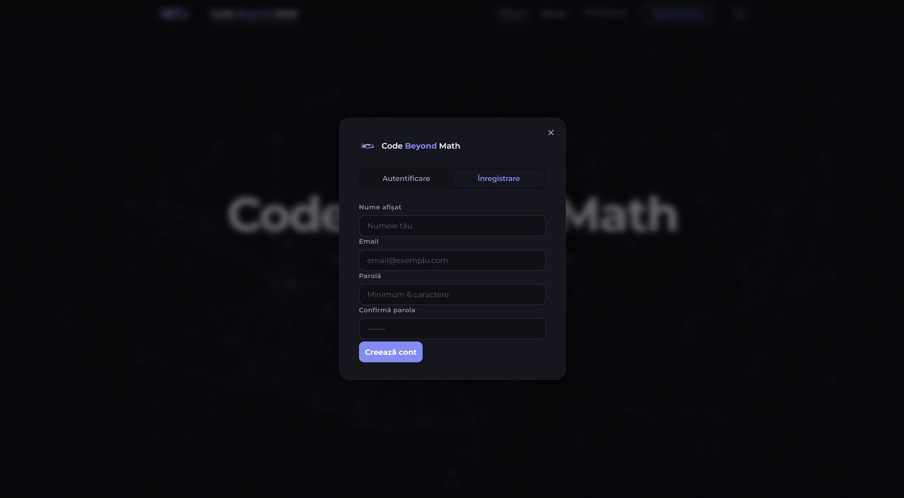

**Autentificare** — utilizatorii existenți se pot conecta cu email și parolă. La autentificare reușită, sesiunea este persistată automat de SDK-ul Supabase în `localStorage`, astfel că utilizatorul rămâne conectat și după închiderea tab-ului.

**Recuperare parolă** — utilizatorii care și-au uitat parola pot solicita un email de resetare direct din fereastra de autentificare.

**Deconectare** — sesiunea poate fi încheiată oricând, cu invalidarea tokenului JWT pe partea Supabase.

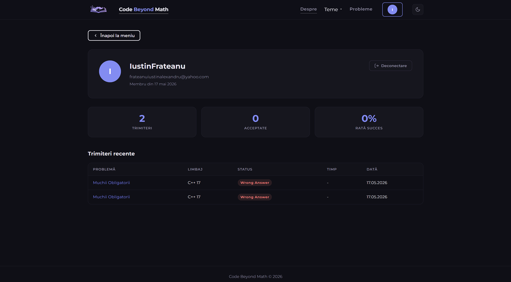

Starea de autentificare este reflectată vizual în interfață: butonul din navbar se schimbă în funcție de dacă există sau nu o sesiune activă.

---

### Randare dinamică Markdown

Conținutul teoretic al fiecărei teme nu este scris direct în HTML, ci stocat în fișiere `.md` separate (în folderul `md/`). Atunci când utilizatorul navighează la o temă, `script.js` încarcă asincron fișierul Markdown corespunzător și îl convertește în HTML, inserându-l dinamic în pagină.

Această abordare oferă mai multe avantaje:
- **Separarea conținutului de cod** — textul educațional poate fi editat fără a atinge logica aplicației
- **Lizibilitate sporită** — fișierele `.md` sunt ușor de citit și modificat chiar și fără un editor specializat
- **Extensibilitate** — adăugarea unei teme noi înseamnă crearea unui fișier `.md` și a unui widget `.js`, fără a modifica structura HTML

---

### Galerie vizuală de fractali

Tema 5 (Jocul Haosului) este însoțită de o galerie de imagini cu fractalii generabili prin platforma, stocate în folderul `poze/`. Galeria ilustrează vizual diversitatea formelor care pot apărea din același algoritm simplu, aplicat unor poligoane de bază diferite sau unor reguli de selecție diferite:

- Triunghiul lui Sierpiński (baza clasică a Chaos Game)
- Fractal dragon, pentagonal, tip frunză, tip arțar, pentigree

Imaginile servesc atât ca material ilustrativ pentru secțiunea teoretică, cât și ca referință pentru utilizatorul care rulează propria simulare în widget.

---

### Navigare SPA fluidă

Platforma funcționează ca o Single-Page Application: odată încărcată, nicio navigare internă nu provoacă reîncărcarea paginii. Trecerea între pagina principală, oricare dintre cele șase teme și secțiunea de probleme se face instant, prin actualizarea hash-ului URL și a DOM-ului de către `script.js`.

URL-urile sunt bookmarkable — fiecare secțiune are propriul hash (de ex. `#tema1`, `#probleme`), astfel că utilizatorul poate salva sau trimite un link direct către o anumită temă.

---

### Design responsiv

Interfața este proiectată să funcționeze corect atât pe ecrane mari de desktop, cât și pe dispozitive mobile și tablete. Layout-ul se adaptează automat la lățimea ecranului prin CSS, asigurând o experiență de utilizare fluentă indiferent de device. Widget-urile interactive sunt de asemenea utilizabile pe touchscreen.

---

## IV. Structura temelor

Fiecare temă urmează același tipar: o secțiune teoretică urmată de unul sau mai multe widget-uri interactive.

### Tema 1 — Criptarea prin matrice
**Concept:** Criptografia bazată pe algebră liniară — un mesaj este transformat într-un vector numeric, înmulțit cu o matrice-cheie și redus modulo un număr prim, producând textul cifrat. Decriptarea se face prin înmulțirea cu inversa matricei.

**Widget-uri:**
- `tema1-widget.js` — permite utilizatorului să introducă un mesaj și o cheie și să vadă procesul de criptare/decriptare pas cu pas
- `tema1-example-widget.js` — exemplu demonstrativ cu valori predefinite

---

### Tema 2 — Numărul de arbori dintr-un graf
**Concept:** Teorema lui Kirchhoff (Matrix Tree Theorem) — numărul de arbori de acoperire ai unui graf poate fi calculat ca orice minor al matricei sale Laplacian.

**Widget-uri:**
- `tema2-widget.js` — vizualizarea grafului și a arborilor săi de acoperire
- `tema2-calc-widget.js` — calculator interactiv pentru teorema Kirchhoff

---

### Tema 3 — Algoritmii de FFT și NTT
**Concept:** Transformata Rapidă Fourier (FFT) și varianta sa în aritmetică modulară (NTT) permit înmulțirea a două polinoame de grad n în O(n log n) în loc de O(n²), cu aplicații în procesarea semnalelor și algoritmică competitivă.

**Widget:** `tema3-widget.js` — demonstrație interactivă a înmulțirii polinoamelor prin NTT

---

### Tema 4 — Împachetarea punctelor în pătrat
**Concept:** Problemă de geometrie combinatorie — determinarea numărului maxim de puncte care pot fi plasate într-un pătrat de latură L astfel încât distanța minimă dintre oricare două puncte să fie cel puțin 1. Sunt prezentate limitele teoretice și configurațiile optime cunoscute.

**Widget:** `tema4-widget.js` — vizualizarea interactivă a configurațiilor de puncte

---

### Tema 5 — Jocul Haosului
**Concept:** *Chaos Game* — un algoritm iterativ simplu: se alege aleator un vârf al unui poligon și se mută reperul la jumătatea distanței față de acesta. Deși procesul pare aleator, converge spre fractali autosimilari (ex. triunghiul lui Sierpiński).

**Widget:** `tema5-widget.js` — simulare în timp real, cu parametri configurabili

**Galerie de fractali** (în `poze/`):

| Fișier | Fractal generat |
|---|---|
| `triunghi_fr.png` | Triunghiul lui Sierpiński |
| `dr_fr.png` | Fractal dragon |
| `frunza_fr.png` | Fractal tip frunză |
| `maple_fr.png` | Fractal tip arțar |
| `pentagon_fr.png` | Fractal pentagonal |
| `pentigree_fr.png` | Pentigree |

---

### Tema 6 — Conway's Game of Life
**Concept:** Automatul celular al lui John Horton Conway — o grilă 2D de celule vii/moarte evoluează după 4 reguli simple de vecinătate, producând comportamente surprinzător de complexe: structuri stabile, oscilatoare, planoare.

**Widget:** `tema6-widget.js` — simulare interactivă, utilizatorul poate desena configurații și porni/opri simularea

---

## V. Structura problemelor

Secțiunea de probleme este gestionată de `probleme-widget.js` și conține o colecție de exerciții de algoritmică și matematică organizate în cinci categorii tematice, aliniate la temele platformei:

| Categorie | Teme acoperite |
|---|---|
| **Criptografie** | Algebră liniară modulară, criptare/decriptare prin matrice |
| **Teoria grafurilor** | Arbori de acoperire, matrice Laplacian, numărare combinatorie |
| **NTT / FFT** | Convoluții, înmulțiri de polinoame, transformate în Z_p |
| **Geometrie** | Împachetări, distanțe minime, configurații de puncte |
| **Fractali** | Automate celulare, sisteme iterative de funcții, dimensiune fractală |

Accesul la secțiunea de probleme necesită autentificare. Problemele sunt gândite ca o continuare naturală a temelor teoretice, cu dificultate gradată.

---

## VI. Securitate și API

### Autentificare

Platforma folosește **Supabase Auth** pentru gestionarea utilizatorilor. Fluxul de autentificare:

```
Utilizator introduce email + parolă
        │
        ▼
  supabase.auth.signInWithPassword()
        │
        ▼
  Supabase returnează JWT token
        │
        ▼
  Token stocat în localStorage de SDK
        │
        ▼
  Sesiune activă — acces la funcționalități protejate
```

Funcționalitățile disponibile:
- **Înregistrare** cu nume de afișare, email și parolă
- **Autentificare** email + parolă
- **Recuperare parolă** prin email
- **Deconectare** cu invalidarea sesiunii

### Client Supabase

Conexiunea la Supabase este configurată în `supabase.js` folosind SDK-ul oficial `@supabase/supabase-js`. Toate apelurile către baza de date și autentificare trec prin acest client. Credențialele folosite sunt **cheia publică anonimă** (`anon key`) a proiectului Supabase — aceasta este sigură să fie expusă în codul front-end, deoarece accesul la date este controlat prin politicile **Row Level Security (RLS)** definite pe partea Supabase.

### Securitatea datelor

- Parolele nu sunt stocate sau procesate local — sunt gestionate exclusiv de Supabase Auth
- Comunicarea cu Supabase se face exclusiv prin HTTPS
- Accesul la resursele protejate (secțiunea de probleme) este condiționat de existența unui JWT valid în sesiune
- Tokenul de sesiune este gestionat automat de SDK-ul Supabase

---

## VII. Deployment

Platforma este hostatǎ pe **GitHub Pages** și se deployează automat la fiecare push pe branch-ul `main`.

### Rulare locală

Proiectul nu necesită niciun proces de build sau dependențe instalate. Este suficient un server HTTP local (pentru a evita restricțiile CORS la încărcarea fișierelor `.md`):

```bash
# Clonează repository-ul
git clone https://github.com/CodeBeyondMath/Code-Beyond-Math.git
cd Code-Beyond-Math

# Opțiunea 1 — Python (recomandat, preinstalat pe majoritatea sistemelor)
python -m http.server 8000

# Opțiunea 2 — Node.js
npx serve .

# Opțiunea 3 — VS Code
# Instalează extensia "Live Server" și dă click pe "Go Live"
```

Accesează apoi `http://localhost:8000` în browser.

> ⚠️ Nu deschide `index.html` direct cu `file://` — cererile `fetch()` către fișierele `.md` vor fi blocate de browser din cauza politicii CORS.

### Structura fișierelor

```
Code-Beyond-Math/
│
├── index.html                  # Pagina principală — tot conținutul SPA
├── style.css                   # Stiluri globale și responsive
├── script.js                   # Router SPA, navigare, randare Markdown
├── auth.js                     # Logică autentificare (login, register, logout)
├── supabase.js                 # Inițializare client Supabase
├── logo.png                    # Logo platformă
│
├── probleme-widget.js          # Widget secțiunea de probleme
├── tema1-widget.js             # Widget — Criptarea prin matrice
├── tema1-example-widget.js     # Exemplu demonstrativ — Tema 1
├── tema2-widget.js             # Widget — Numărul de arbori dintr-un graf
├── tema2-calc-widget.js        # Calculator — Teorema Kirchhoff
├── tema3-widget.js             # Widget — FFT și NTT
├── tema4-widget.js             # Widget — Împachetarea punctelor în pătrat
├── tema5-widget.js             # Widget — Jocul Haosului
├── tema6-widget.js             # Widget — Conway's Game of Life
│
├── md/                         # Conținut teoretic al temelor (Markdown)
│   ├── tema1.md
│   ├── tema2.md
│   ├── tema3.md
│   ├── tema4.md
│   ├── tema5.md
│   └── tema6.md
│
└── poze/                       # Imagini ilustrative
    ├── 1.png
    ├── 2.png
    ├── 3.png
    ├── dr_fr.png
    ├── frunza_fr.png
    ├── maple_fr.png
    ├── pentagon_fr.png
    ├── pentigree_fr.png
    └── triunghi_fr.png
```

---

## VIII. Demo-uri și Capturi de Ecran

Site-ul live: **[codebeyondmath.github.io/Code-Beyond-Math](https://codebeyondmath.github.io/Code-Beyond-Math/)**

### Pagina principală
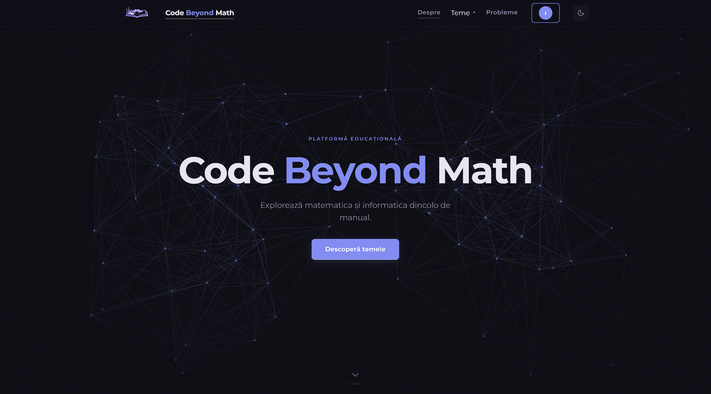

### Exemple teme interactive
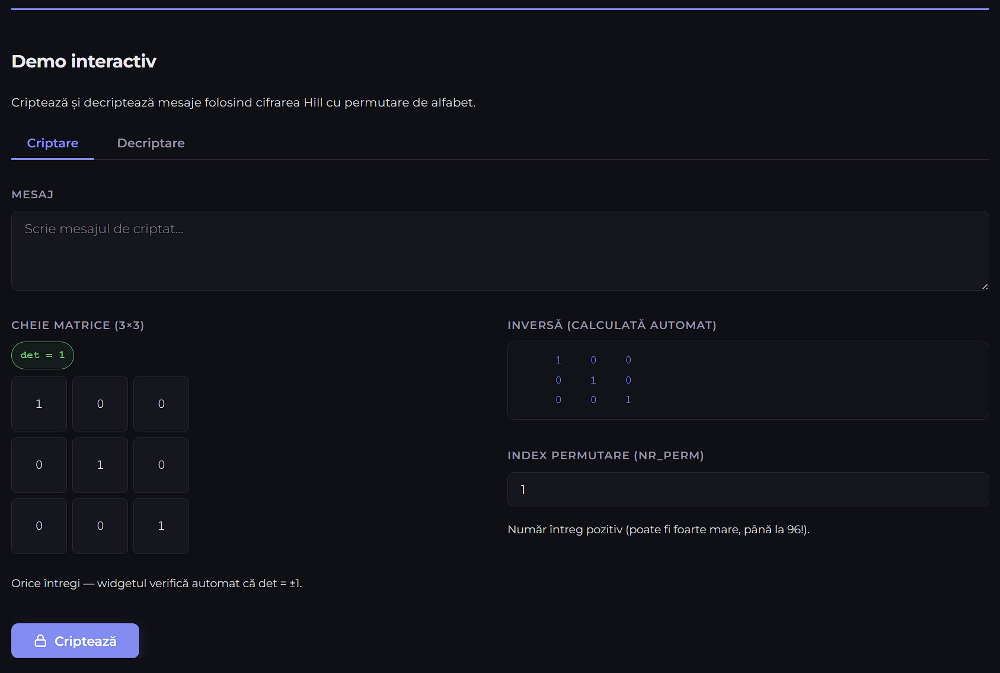
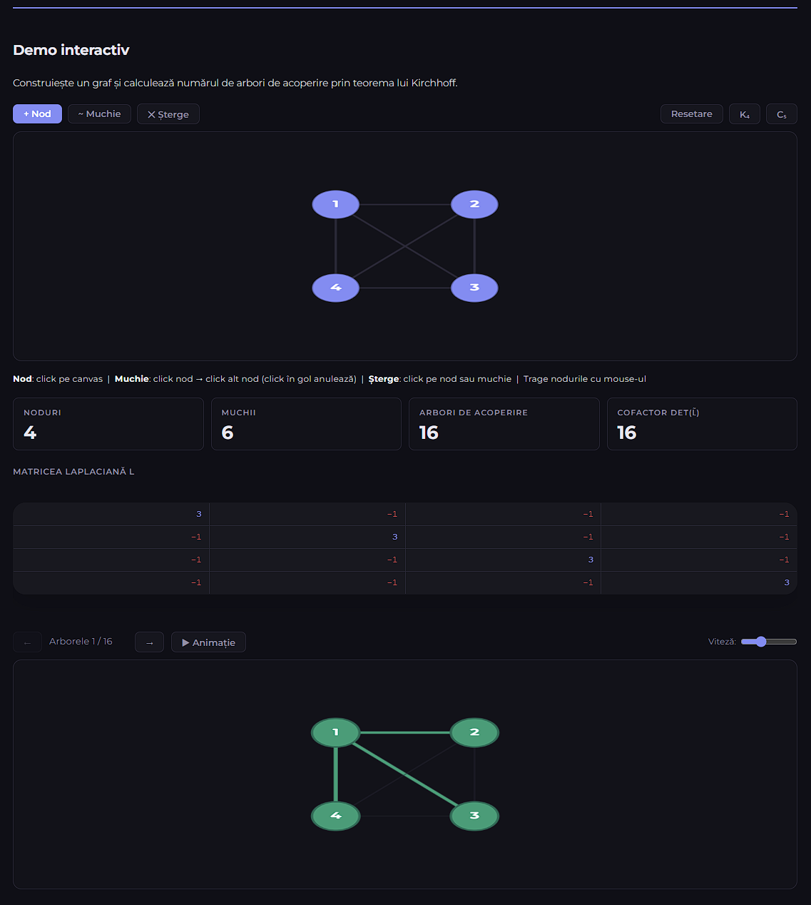
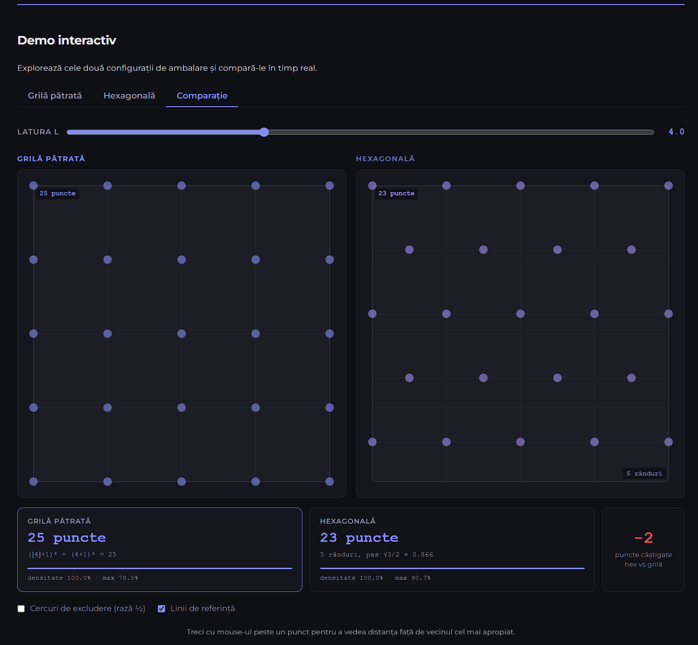

### Fractali generați de Jocul Haosului

| Triunghi Sierpiński | Fractal tip frunză | Fractal pentagonal |
|:---:|:---:|:---:|
| 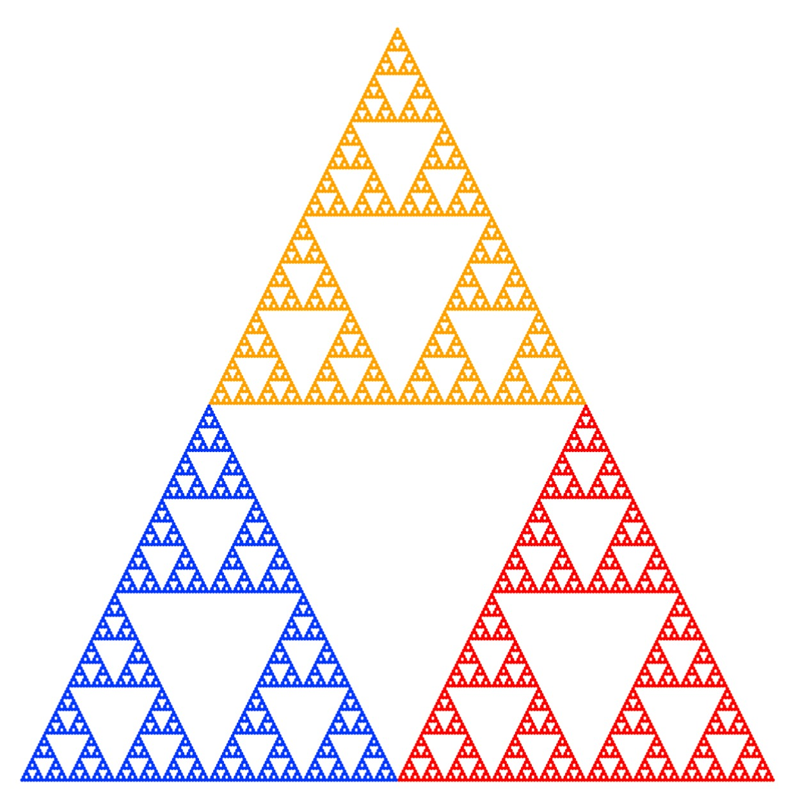 |  | 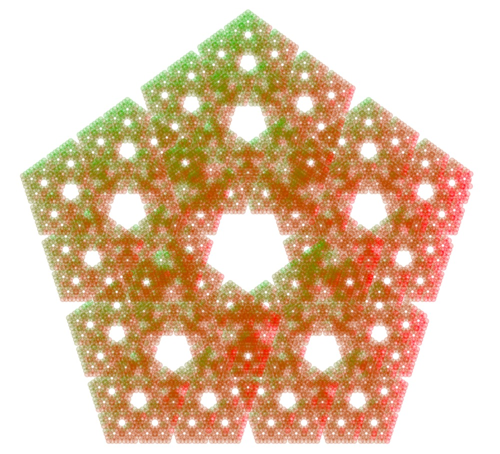 |

| Fractal tip arțar | Pentigree | Fractal dragon |
|:---:|:---:|:---:|
| 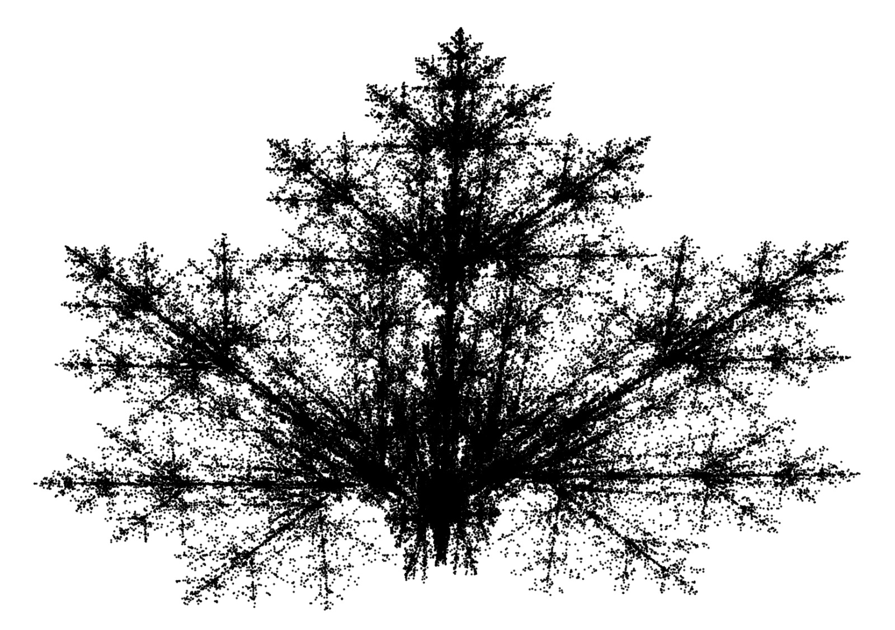 | 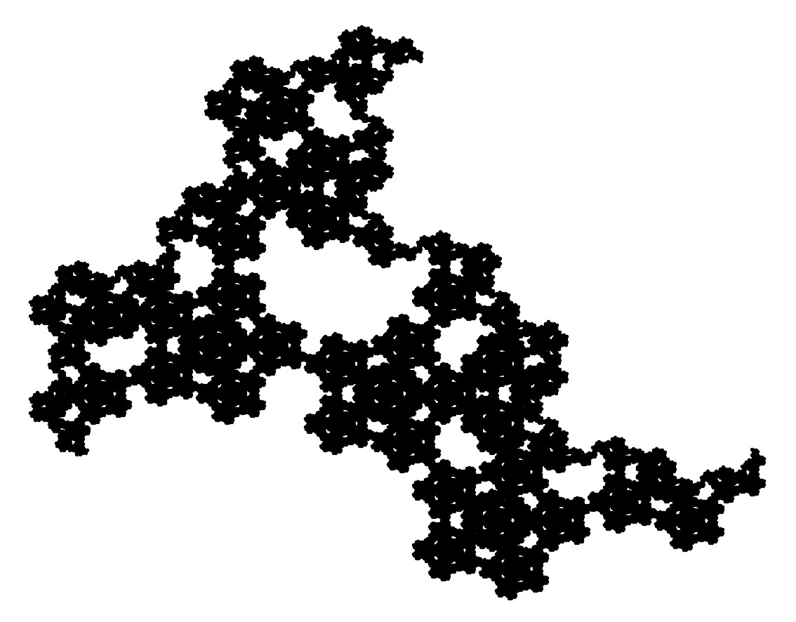 | 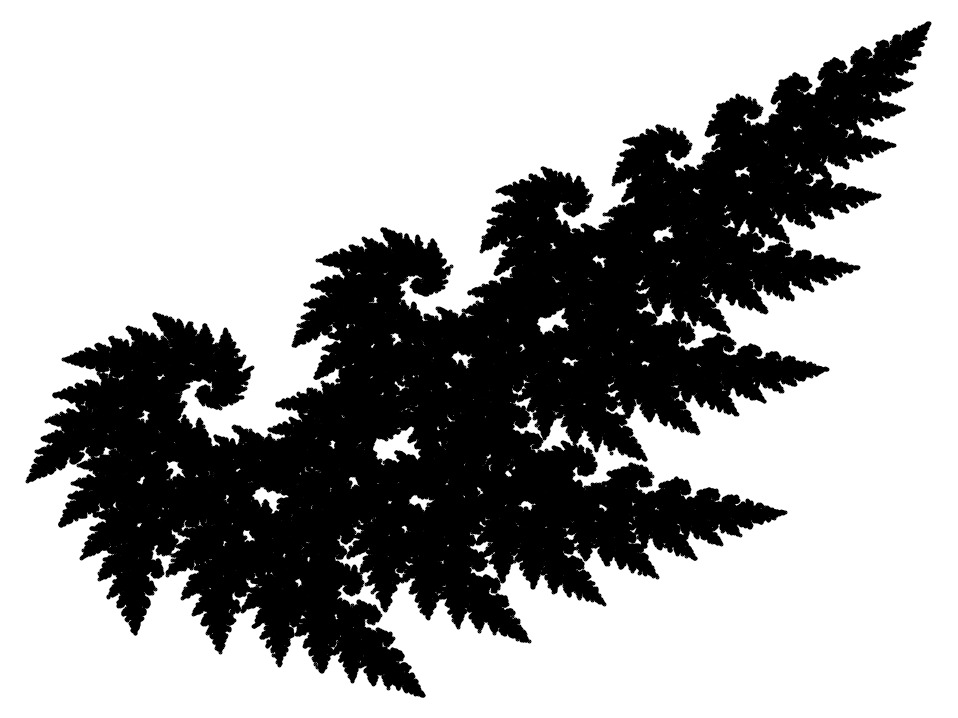 |

---

## IX. Echipă și Contact

Proiect realizat în cadrul competiției **InfoEducație 2026**, categoria *Software cu caracter educațional*.

| Nume | Rol |
|---|---|
| **Frățeanu Iustin-Alexandru** | Co-autor - contributor principal |
| **Caunic Rareș-Octavian** | Co-autor - contributor secundar |

---

*Code Beyond Math © 2026*
